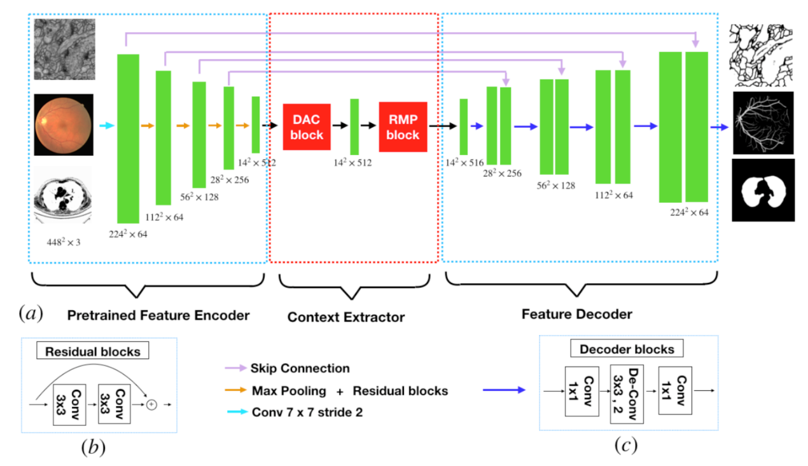

# Home page of Jun Cheng:
## Brief Bio:
Jun Cheng received the B. E. degree in electronic engineering and information science from the University of Science and Technology of China, and the Ph. D. degree in electrical and electronic engineering from Nanyang Technological University, Singapore. In 2009, he joined the Institute for Infocomm Research, Agency of Science, Technology and Research (A*STAR), Singapore. Earlier, he worked for more than two years with Panasonic Singapore Laboratories.

He is now a professor in Cixi Institute of Biomedical Engineering, Chinese Academy of Sciences, China. He was a senior scientist and the research lead  in the Intelligent Medical Imaging (iMED) department in the Institute for Infocomm Research, leading the research of medical image processing & understanding. He has developed many algorithms for automated ocular disease detection including glaucoma, age-related macular degeneration, pathological myopia. He has received the IES Prestigious Engineering Achievement Award 2013. His research interests include computer vision, image processing, medical imaging and machine learning. Previously, he worked on automatic glaucoma screening in AGLAIA project and his technology for glaucoma screening has been licensed. He is currently the PI of the Automatic Cardiac optical coherence Tomograph Image Analysis for coronary artery disease risk assessment (ACTIA) project. He has authored/co-authored many publications at prestigious journals/conferences, such as TMI, TIP, TBME, IOVS, JAMIA, MICCAI, CVPR and invented more than 10 patents. He serves as reviewers for many journal and conferences. He is currently associate editor for TMI. 

* ***Associate Editor***:
  **IEEE TMI**
* ***Area Chair***:
  **MICCAI 2017**
  **MICCAI 2019**
* Professor of Chinese Academy of Sciences

## News:
"CE-Net: Context Encoder Network for Medical Image Segmentation", 
Zaiwang Gu, Jun Cheng, Huazhu Fu, Kang Zhou, Huaying Hao, Yitian Zhao, Tianyang Zhang, Shenghua Gao, Jiang Liu, 
IEEE Transactions on Medical Imaging (**TMI**), 2019. [\[PDF\]](https://arxiv.org/abs/1903.02740) [\[Code\]](https://github.com/Guzaiwang/CE-Net) ***"MICS 2019 Best poster!"***

## Publication：
### Book Chapter: 
* Jun Cheng, F. Yin, D. W. K. Wong, J. Liu, Automatic segmentation of retinal images for glaucoma screening, Frontiers of Medical Imaging, C. H. Chen (eds.), World Scientific, 2014

### Journal:

Z. Gu, Jun Cheng*, H. Fu, K. Zhou, H. Hao, Y. Zhao, T. Zhang, S. Gao and J. Liu, CE-Net: Context Encoder Network for 2D Medical Image Segmentation, in press, IEEE Trans. On Medical Imaging, 2019. (MICS Best Poster 2019)

Y. Jiang, L. Duan*, Jun Cheng*, Zaiwang Gu, Hu Xia, Huazhu Fu, Changsheng Li and Jiang Liu, JointRCNN: A Region-based Convolutional Neural Network for Optic Disc and Cup Segmentation, IEEE Trans. On Biomedical Engineering, 2019.  

C. W. Lim, Jun Cheng, E. L. T. Tay, H. Y. Teo, E. P. Y. Wong, V. K. Y. Yong, B. A. Lim, O. K. Hee, H. T. Wong, L. W. L. Yip, Optical coherence tomography of the macula and optic nerve head: microvascular density and test-retest repeatability in normal subjects, BMC ophthalmology, 2018.

V. C. H. Yip, H. T. Wong, V. K. Y. Yong, B. A. Lim, O. K. Heel，Jun Cheng, H. Fu, C. W. Lim, E. L. T. Tay, R. GLoo-Valdez, H. Y. Teo, A. P. H. Lim, L. W. L. Yip, Optical coherence tomography angiography of optic disc and macular vessel density in glaucoma and healthy eyes, Journal of Glaucoma, 2018.

Jun Cheng, "Sparse Range-constrained Learning and Its Application for Medical Image Grading",  IEEE Transactions on Medical Imaging, vol. 37, no. 12, pp. 2729-2738, 2018. 

Jun Cheng, Z. Li, Z. Gu, H. Fu, D. W. K. Wong,  J. Liu，"Structure-preserving Guided Retinal Image Filtering and Its Application for Optic Disc Analysis", IEEE Transactions on Medical Imaging, vol. 37, no. 11, pp. 2536-2546, 2018.

H. Fu, Jun Cheng*, Y. Xu, C. Zhang, D. W. K.Wong, J. Liu, X. Cao, "Disc-aware Ensemble Network for Glaucoma Screening from Fundus Image",  IEEE Transactions on Medical Imaging, vol. 37, no. 11, pp. 2493-2501, 2018. 

H. Fu, Jun  Cheng, Y. Xu,  D. W. K. Wong, J. Liu and X. Cao, Joint Optic Disc and Cup Segmentation Based on Multi-label Deep Network and Polar Transformation, IEEE Transactions on Medical Imaging, vol. 37, no 7, pp. 1597-1605, 2018. 

R. Srivastava, A. P. Yow, Jun Cheng, D. W. K. Wong,  H. L. Tey, "3D graph-based skin layer segmentation in optical coherence tomography images for roughness estimation", Biomedical Optics Express, vol. 9, no. 8, pp. 3590-3606, 2018.

A. Li, Z. Niu, Jun Cheng, F. Yin, D. W. K. Wong, S. Yan, J. Liu, Learning Supervised Descent Directions for Optic Disc Segmentation, Neurocomputing, vol. 275, pp. 350-357 2018.

Jun Cheng, Z. Zhang, D. Tao, D. W. K. Wong, J. Liu, M. Baskaran, T. Aung, T. Y. Wong, Similarity regularized Sparse Group Lasso for Cup to Disc Ratio Computation, Biomedical Optics Express, vol. 8, issue  8, pp. 3763-3777, 2017.

Jun Cheng, D. Tao, D. W. K. Wong, and J. Liu, Quadratic divergence regularized SVM for Optic Disc Segmentation, Biomedical Optics Express, vol.8, issue 5, pp. 2687-2696, 2017.

Jun Cheng, D. Tao, Y. Quan, D. W. K. Wong,  G. C. M. Cheung, M. Akiba and J. Liu, Speckle Reduction in 3D Optical Coherence Tomography of Retina  by A-Scan Reconstruction, IEEE Trans on Medical Imaging, vol. 35, no. 10, pp. 2270-2279, 2016. 

Jun Cheng, F. Yin, D. W. K. Wong, D. Tao and J. Liu, Sparse Dissimilarity-Constrained Coding For Glaucoma Screening, IEEE Trans. on Biomedical Engineering, vol. 62, Issue 5, pp. 1395-1403, 2015.

M. Baskaran, Jun Cheng, S. A. Perera, T. A. Tun, J. Liu and T. Aung, Automated Analysis of Angle Closure From Anterior Chamber Angle Images, Investigative Ophthalmology & Visual Science, 55(11):7669-7673, 2014. 

Jun Cheng,  J. Liu, Y. Xu, F. Yin, D. W. K. Wong, N. M. Tan, D. Tao, C. Y. Cheng, T. Aung and T. Y. Wong, Superpixel Classification based Optic Disc and Optic Cup Segmentation for Glaucoma Screening, IEEE Trans. on Med. Imaging, vol. 32, no. 6, pp. 1019-1032, 2013.  (Selected for highlighting by A*STAR Research)

J. Liu, Z. Zhang, D. W. K. Wong, Y. Xu, F. Yin, Jun Cheng, N. M. Tan , C. K. Kwoh, D. Xu, Y. C. Tham, T. Aung and T. Y. Wong, Automatic Glaucoma Diagnosis through Medical Imaging Informatics, Journal of the American Medical Informatics Association, 20(6):1021-7, 2013.

Jun Cheng, D. Tao, J. Liu, D. W. K. Wong, N. M. Tan, T. Y. Wong and S. M. Saw, Peripapillary Atrophy Detection  by Sparse Biologically Inspired Feature Manifold, IEEE Trans. on Med. Imaging, vol. 31, no. 12, pp. 2355-2365, 2012. (IF2012: 4.027) 

M. H. Wong, A. Chew, H. M. Htoon, B. H. Lee, Jun Cheng, J. Liu, D. T. Tan and J. S. Mehta, Reproducibility of Corneal Graft Thickness measurements with COLGATE in patients who
have undergone DSAEK (Descemet Stripping Automated Endothelial Keratoplasty, BMC Med Imaging,12(1):25, 2012. 

Jun Cheng and A. C. Kot, “Steganalysis of halftone images using inverse halftoning”, Signal Processing , vol. 89, Issue 6, pp. 1000-1010, June 2009. 

Jun Cheng and A. C. Kot, “Objective distortion measure for binary text image based on edge line segment similarity”, IEEE Trans. On Image Processing,  vol. 16, pp. 1691-1695, June 2007. 
