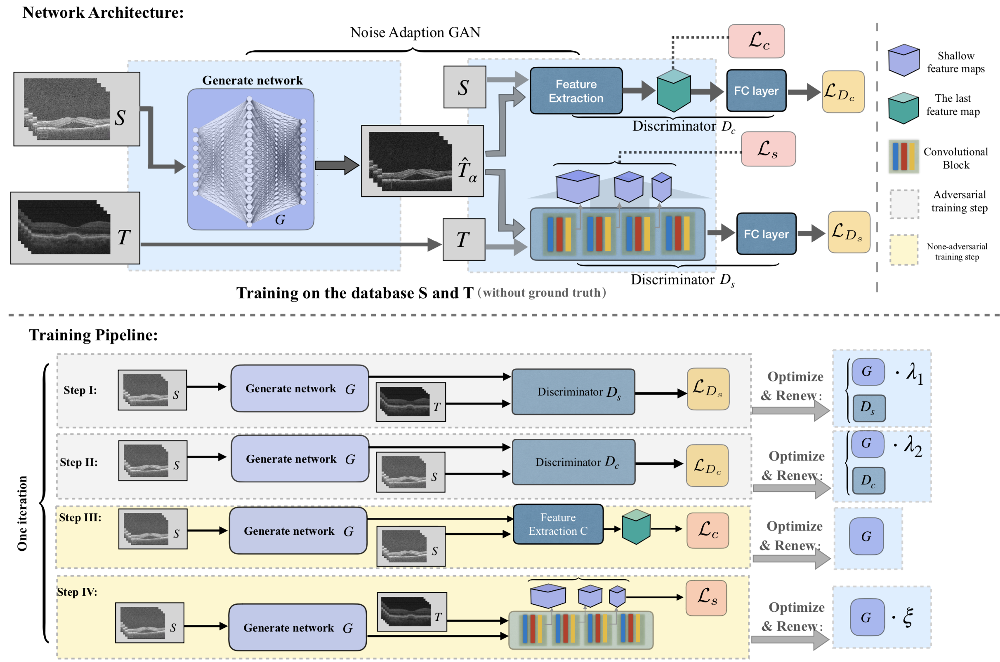

# Jun CHENG (程骏) 
## Professor
## Cixi Institute of Biomedical Engineering, Chinese Academy of Sciences, China

### Call For Papers: The ["Special Issue on Ophthalmic Image Analysis and Informatics"](https://jbhi.embs.org/special-issues/ophthalmic-image-analysis-and-informatics)  in IEEE Journal of Biomedical and Health Informatics (IEEE J-BHI, IF = 4.217).

## Brief Bio:
Jun Cheng received the B. E. degree in electronic engineering and information science from the University of Science and Technology of China, and the Ph. D. degree in electrical and electronic engineering from Nanyang Technological University, Singapore. In 2009, he joined the Institute for Infocomm Research, Agency of Science, Technology and Research (A\*STAR), Singapore. Earlier, he worked for more than two years with Panasonic Singapore Laboratories.

He is now a professor in Cixi Institute of Biomedical Engineering, Chinese Academy of Sciences, China. He was a senior scientist and the research lead  in the Intelligent Medical Imaging (iMED) department in the Institute for Infocomm Research, leading the research of medical image processing & understanding. He has developed many algorithms for automated ocular disease detection including glaucoma, age-related macular degeneration, pathological myopia. He has received the IES Prestigious Engineering Achievement Award 2013. His research interests include computer vision, image processing, medical imaging and machine learning. Previously, he worked on automatic glaucoma screening in AGLAIA project and his technology for glaucoma screening has been licensed. He is currently the PI of the Automatic Cardiac optical coherence Tomograph Image Analysis for coronary artery disease risk assessment (ACTIA) project. He has authored/co-authored many publications at prestigious journals/conferences, such as TMI, TIP, TBME, IOVS, JAMIA, MICCAI, CVPR and invented more than 10 patents. He serves as reviewers for many journal and conferences. He is currently associate editor for TMI. 

## Research Interest: 
* Computer Vision
* Medical Image Computing
* Machine Learning

## Academic Services 

### ***Associate Editor***:
*  **IEEE Transactions on Medical Imaging** 2015-present

### ***Guest Editor***:
*  **IEEE Journal on Biomedical and Health Informatics** Special Issue on Ophthalmic Image Analysis and Informatics, 2019

### ***Area Chair***:
*  **MICCAI 2017**
*  **MICCAI 2019**

## Project:
* "Noise Adaptation Generative Adversarial Network for Medical Image Analysis",
Tianyang Zhang, **Jun Cheng**\*, Huazhu Fu, Zaiwang Gu, Yuting Xiao, Kang Zhou, Shenghua Gao, Rui Zheng, Jiang Liu,
IEEE Transactions on Medical Imaging (**TMI**), 2019.
[\[Code\]](https://github.com/NeilZhang-IMED/NAGAN)    

* "CE-Net: Context Encoder Network for Medical Image Segmentation", 
Zaiwang Gu, **Jun Cheng**\*, Huazhu Fu, Kang Zhou, Huaying Hao, Yitian Zhao, Tianyang Zhang, Shenghua Gao, Jiang Liu, 
IEEE Transactions on Medical Imaging (**TMI**),  vol. 38, no. 10, pp. 2281-2292, 2019. [\[PDF\]](https://arxiv.org/abs/1903.02740) [\[Code\]](https://github.com/samjcheng/CE-Net)   ***"MICS 2019 Best poster!"*** 

## Kenote Speech & Invited Talks:

* Glaucoma Screening from Fundus Images And Its Challenges, at BOOM workshop in conjuction with IJCAI 2019.
* Structure-preserving guided retinal image filtering and its application for optic disc analysis, MICS 2019.

## News:  
* 2019-10：One paper "Dense Dilated Network with Probability Regularized Walk for Vessel Detection" has been accepted by IEEE TMI.
* 2019-10：One paper "Automatic Fibroatheroma Identification in Intravascular Optical Coherence Tomography Volumes" has been accepted by JAIHC.
* 2019-09: One paper "Noise Adaptation Generative Adversarial Network for Medical Image Analysis" has been accepted by IEEE TMI.
* 2019-08: Keynote Talk on "Glaucoma Screening from Fundus Images And Its Challenges” at BOOM workshop in conjuction with IJCAI 2019.
* 2019-07: Our TMI paper "CE-Net: Context Encoder Network for Medical Image Segmentation" won the MICS best poster award.
* 2019-07: Be the Guest Editor of Special Issue on  ["Special Issue on Ophthalmic Image Analysis and Informatics"](https://jbhi.embs.org/special-issues/ophthalmic-image-analysis-and-informatics) in IEEE J-BHI.
* 2019-07: One paper "A Deep Step Pattern Representation for Multimodal Retinal Image Registration" has been accepted by ICCV 2019.  
* 2019-07: Invited Talk on "Structure-preserving guided retinal image filtering and its application for optic disc analysis" at MICS 2019. 
* 2019-06: Three papers have been accepted by MICCAI 2019.
* 2019-04: One paper "JointRCNN: A Region-based Convolutional Neural Network for Optic Disc and Cup Segmentation" has been accepted by IEEE TBME.
* 2019-03: One paper "CE-Net: Context Encoder Network for Medical Image Segmentation" has been accepted by IEEE TMI. 

## Selected Publications:  

## 2019
* **Dense Dilated Network with Probability Regularized Walk for Vessel Detection**,    
Lei Mou, Li Chen\*,  **Jun Cheng**\*, Zaiwang Gu, Yitian Zhao and Jiang Liu,  
IEEE Trans. On Medical Imaging (**TMI**), 2019.
* **Automatic Fibroatheroma Identification in Intravascular Optical Coherence Tomography Volumes**,  
Qifeng Yan, Mengdi Xu,Damon Wing Kee Wong, Akira Taruya, Atsushi Tanaka, Jiang Liu, Philip Wong, **Jun Cheng***,
Journal of Ambient Intelligence and Humanized Computing, 2019.
* **Noise Adaptation Generative Adversarial Network for Medical Image Analysis**,  
Tianyang Zhang, **Jun Cheng**\*, Huazhu Fu, Zaiwang Gu, Yuting Xiao, Kang Zhou, Shenghua Gao, Rui Zheng, Jiang Liu,
IEEE Trans. On Medical Imaging (**TMI**), 2019. [\[Code\]](https://github.com/NeilZhang-IMED/NAGAN)    
* **CE-Net: Context Encoder Network for 2D Medical Image Segmentation**,   
Zaiwang Gu, **Jun Cheng**\*, Kang Zhou, Huaying Hao, Yitian Zhao, Tianyang Zhang, Shenghua Gao, Jiang Liu,    
IEEE Trans. On Medical Imaging (**TMI**), vol. 38, no. 10, pp. 2281-2292, 2019. [\[PDF\]](https://arxiv.org/abs/1903.02740) [\[Code\]](https://github.com/samjcheng/CE-Net)   
***"MICS 2019 Best poster!"*** 
* **JointRCNN: A Region-based Convolutional Neural Network for Optic Disc and Cup Segmentation**,  
Yuming Jiang, Lixin Duan\*, **Jun Cheng**\*, Zaiwang Gu, Hu Xia, Huazhu Fu, Changsheng Li, Jiang Liu,    
IEEE Trans. On Biomedical Engineering (**TBME**), 2019.  
* **Optical coherence tomography angiography of optic disc and macular vessel density in glaucoma and healthy eyes**,   
V. C. H. Yip, H. T. Wong, V. K. Y. Yong, B. A. Lim, O. K. Heel, **Jun Cheng**, H. Fu, C. W. Lim, E. L. T. Tay, R. GLoo-Valdez, H. Y. Teo, A. P. H. Lim, L. W. L. Yip,      
Journal of Glaucoma (**JOG**), Jan;28(1):80-87, 2019.
* **A Deep Step Pattern Representation for Multimodal Retinal Image Registration**,  
Jimmy Addison Lee, Peng Liu, **Jun Cheng**\* and Huazhu Fu,   
in IEEE International Conference in Computer Vision (**ICCV**), 2019.
* **Topology Reconstruction of Tree-like Structure in Images via Structural Similarity Measure and Dominant Set Clustering**,  
Jianyang Xie, Yitian Zhao, Yonghuai Liu, Pan Su, Yalin Zheng, Yifan Zhao, **Jun Cheng**, Jiang Liu,   
in IEEE International Conference in Computer vision and Pattern Recognition (**CVPR**), Long Beach, USA, June, 2019. 
* **Ki-GAN: Knowledge Infusion Generative Adversarial Network for Photoacoustic Image Reconstruction in vivo**,  
Hengrong Lan, Kang Zhou, Changchun Yang, **Jun Cheng**, Jiang Liu, Shenghua Gao, Fei Gao 
in International Conference on Medical Image Computing and Computer Assisted Intervention (**MICCAI**), 2019.
* **CS-Net: Channel and Spatial Attention Network for Curvilinear Structure Segmentation**,   
Lei Mou, Yitian Zhao, Li Chen, **Jun Cheng**, Zaiwang Gu, Huaying Hao, Hong Qi,  Yalin Zheng, Alex Frangi, Jiang Liu,    
in International Conference on Medical Image Computing and Computer Assisted Intervention (**MICCAI**), 2019.
* **SkrGAN: Sketching-rendering Unconditional Generative Adversarial Networks for Medical Image Synthesis**,  
Tianyang Zhang, Huazhu Fu, Yitian Zhao, **Jun Cheng**, Mengjie Guo, Zaiwang Gu, Bing Yang, Yuting Xiao, Shenghua Gao, Jiang Liu,   
in International Conference on Medical Image Computing and Computer Assisted Intervention (**MICCAI**), 2019.

## 2018
* **Sparse Range-constrained Learning and Its Application for Medical Image Grading**,   
**Jun Cheng**\*,   
IEEE Transactions on Medical Imaging (**TMI**), vol. 37, no. 12, pp. 2729-2738, 2018. 
* **Structure-preserving Guided Retinal Image Filtering and Its Application for Optic Disc Analysis**,  
**Jun Cheng**\*, Zhengguo Li, Zaiwang Gu, Huazhu Fu, Damon Wing Kee Wong, Jiang Liu,   
IEEE Transactions on Medical Imaging (**TMI**), vol. 37, no. 11, pp. 2536-2546, 2018.
* **Disc-aware Ensemble Network for Glaucoma Screening from Fundus Image**,  
Huazhu Fu, **Jun Cheng**\*, Yanwu Xu\*,  Changqing Zhang, Damon Wing Kee Wong, Jiang Liu, Xiaochun Cao,  
IEEE Transactions on Medical Imaging (**TMI**), vol. 37, no. 11, pp. 2493-2501, 2018. 
* **Joint Optic Disc and Cup Segmentation Based on Multi-label Deep Network and Polar Transformation**,  
Huazhu Fu, **Jun Cheng**, Yanwu Xu, Damon Wing Kee Wong, Jiang Liu, Xiaochun Cao,   
IEEE Transactions on Medical Imaging (**TMI**), vol. 37, no 7, pp. 1597-1605, 2018. 
* **3D graph-based skin layer segmentation in optical coherence tomography images for roughness estimation"**,  
Ruchir Srivastava, Ai Ping Yow, **Jun Cheng**, Damon Wing Kee Wong,  Hong Liang Tey,   
Biomedical Optics Express (**BOE**), vol. 9, no. 8, pp. 3590-3606, 2018.
* **Learning Supervised Descent Directions for Optic Disc Segmentation**,   
Annan Li, Zhiheng Niu, **Jun Cheng**, Fengshou Yin, Damon Wing Kee Wong, Shuicheng Yan, Jiang Liu,      
Neurocomputing, vol. 275, pp. 350-357 2018.
* **Optical coherence tomography of the macula and optic nerve head: microvascular density and test-retest repeatability in normal subjects**,     
Ching Wei Lim, **Jun Cheng**, Elton Lik Tong Tay, Hwei Yee Teo, Elizabeth Poh Ying Wong, Vernon Khet Yau Yong, Boon Ang Lim, Owen Kim Hee, Hon Tym Wong,	Leonard Wei Leon Yip,   
BMC ophthalmology (**BMC**), 2018.
* **Retinal Artery and Vein Classification via Dominant Sets Clustering-based Vascular Topology Estimation**,  
Yitian Zhao, Jianyang Xie, Yalin Zheng, Yonghuai Liu, Pan Su, Yifan Zhao, **Jun Cheng**, Jiang Liu,   
in International Conference on Medical Image Computing and Computer Assisted Intervention (**MICCAI**), pp. 56-64, Granada, Spain, September, 2018.

## 2017 and before
* **Similarity regularized Sparse Group Lasso for Cup to Disc Ratio Computation**,  
**Jun Cheng**\*, Zhuo Zhang, Dacheng Tao, Damong Wing Kee Wong, Jiang Liu, Mani Baskaran, Tin Aung, Tien Yin Wong,  
Biomedical Optics Express (**BOE**), vol. 8, issue  8, pp. 3763-3777, 2017.
* **Quadratic divergence regularized SVM for Optic Disc Segmentation**,   
**Jun Cheng**\*, Dacheng Tao, Damon Wing Kee Wong, Jiang Liu,   
Biomedical Optics Express (**BOE**), vol.8, issue 5, pp. 2687-2696, 2017.
* **Speckle Reduction in 3D Optical Coherence Tomography of Retina  by A-Scan Reconstruction**,  
**Jun Cheng**\*, Dacheng Tao, Ying Quan, Damon Wing Kee Wong,   Gemmy Chui Ming Cheung, Masahiro Akiba, Jiang Liu,   
IEEE Trans on Medical Imaging (**TMI**), vol. 35, no. 10, pp. 2270-2279, 2016. 
*  **Sparse Dissimilarity-Constrained Coding For Glaucoma Screening**,  
**Jun Cheng**\*, Fengshou Yin, Damon Wing Kee Wong, Dacheng Tao and Jiang Liu,  
IEEE Trans. on Biomedical Engineering (**TBME**), vol. 62, Issue 5, pp. 1395-1403, 2015.
* **Automated Analysis of Angle Closure From Anterior Chamber Angle Images**, 
M. Baskaran, **Jun Cheng**, S. A. Perera, T. A. Tun, J. Liu and T. Aung,   
Investigative Ophthalmology & Visual Science (**IOVS**), 55(11):7669-7673, 2014. 
* **Superpixel Classification based Optic Disc and Optic Cup Segmentation for Glaucoma Screening**,   
**Jun Cheng***,  J. Liu, Y. Xu, F. Yin, D. W. K. Wong, N. M. Tan, D. Tao, C. Y. Cheng, T. Aung and T. Y. Wong,   
IEEE Trans. on Med. Imaging (**TMI**), vol. 32, no. 6, pp. 1019-1032, 2013.  (Selected for highlighting by A\*STAR Research)
* **Automatic Glaucoma Diagnosis through Medical Imaging Informatics**,  
J. Liu, Z. Zhang, D. W. K. Wong, Y. Xu, F. Yin, **Jun Cheng**, N. M. Tan , C. K. Kwoh, D. Xu, Y. C. Tham, T. Aung and T. Y. Wong,    Journal of the American Medical Informatics Association (**JAMIA**), 20(6):1021-7, 2013.
*  **Peripapillary Atrophy Detection  by Sparse Biologically Inspired Feature Manifold**,  
**Jun Cheng**\*, Dacheng Tao, Jiang Liu, Damon Wing Kee Wong, Ngan Meng Tan, Tien Yin Wong and Seang Mei Saw,
IEEE Trans. on Med. Imaging (**TMI**), vol. 31, no. 12, pp. 2355-2365, 2012. (IF2012: 4.027) 
*  **Reproducibility of Corneal Graft Thickness measurements with COLGATE in patients who have undergone DSAEK (Descemet Stripping Automated Endothelial Keratoplasty**,  
M. H. Wong, A. Chew, H. M. Htoon, B. H. Lee, **Jun Cheng**, J. Liu, D. T. Tan and J. S. Mehta,   
BMC Med Imaging (**BMC**),12(1):25, 2012. 
*  **Steganalysis of halftone images using inverse halftoning**,  
**Jun Cheng*** and A. C. Kot,    
Signal Processing , vol. 89, Issue 6, pp. 1000-1010, June 2009. 
* **Objective distortion measure for binary text image based on edge line segment similarity”**,  
**Jun Cheng**\* and A. C. Kot,  
IEEE Trans. On Image Processing (**TIP**),  vol. 16, pp. 1691-1695, June 2007.
* **A robust outlier’s elimination approach for multimodal retinal image registration**,  
Ee Ping Ong, Jimmy Addison Lee, **Jun Cheng**, Guozhen Xu, Beng Hai Lee, Augustinus Laude, Stephen Teoh, Tock Han Lim, Damon W. K. Wong, Jiang Liu,   
in International Conference on Medical Image Computing and Computer Assisted Intervention (**MICCAI**), Part II, LNCS 9350, pp. 329–337, 2015.
*  **Registration of color and OCT fundus image using low-dimensional step pattern analysis**,  
Jimmy Addison Lee, **Jun Cheng**, Guozhen Xu, Ee Ping Ong, Beng Hai Lee, Damon Wing Kee Wong, Jiang Liu,    
in International Conference on Medical Image Computing and Computer Assisted Intervention (**MICCAI**), Part II, LNCS 9350, pp. 214-221, 2015.  
* **A Low-dimensional Step Pattern Analysis Algorithm with Application to Multimodal Retinal Image Registration**,  
Jimmy Addison Lee, **Jun Cheng**, Beng Hai Lee, Ee Ping Ong, Guozhen Xu, Damon Wing Kee Wong, Jiang Liu, Augustinus Laude, Tock Han Lim, 
in Computer Vision and Pattern Recognition (**CVPR**), pp.1046-1053, 2015.  
* **Speckle Reduction in Optical Coherence Tomography by Image Registration and Matrix Completion**,  
**Jun Cheng**\*, Lixin Duan, Damon Wing King Wong, Dacheng Tao, Masaharo Akiba, Jiang Liu,  
in International Conference on Medical Image Computing and Computer Assisted Intervention (**MICCAI**), Part I, LNCS 8673, pp. 162-169, 2014.  
* **Superpixel Classification based Optic Cup Segmentation**,  
**Jun Cheng**\*, Jiang Liu, Dacheng Tao, Fengshou Yin, Damon Wing Kee Wong, Tien Yin Wong,   
in International Conference on Medical Image Computing and Computer Assisted Intervention (**MICCAI**), Part III, LNCS 8151, pp. 421–428, 2013.   
*  **Focal Biologically Inspired Feature for Glaucoma Type Classification**,  
**Jun Cheng**\*, Dacheng Tao, Jiang Liu, Damon Wing Kee Wong, Beng Hai Lee, Mani Baskaran, Tien Yin Wong and Tin Aung,   
Int. Conf. on Medical Image Computing and Computer Assisted Intervention (**MICCAI**), Part III, LNCS 6893, pp. 91-98. Springer, Heidelberg, 2011. 

### Book Chapter: 
* **Automatic segmentation of retinal images for glaucoma screening**,   
**Jun Cheng**, F. Yin, D. W. K. Wong, J. Liu,    
Frontiers of Medical Imaging, C. H. Chen (eds.), World Scientific, 2014
* **Glaucoma Detection Based on Deep Learning Network in Fundus Image**,  
Huazhu Fu, **Jun Cheng**, Yanwu Xu, Jiang Liu,  
Deep Learning and Convolutional Neural Networks for Medical Imaging and Clinical Informatics, Springer, 2019
* **Structure-preserving Guided Retinal Image Filtering for Optic Disc Analysis**   
**Jun Cheng**, Z. Li, H. Fu, Z. Gu, D. W. K. Wong and J. Liu,
Computational Retinal Image Analysis, E. Trucco (eds.), Elsevier, 2019.
