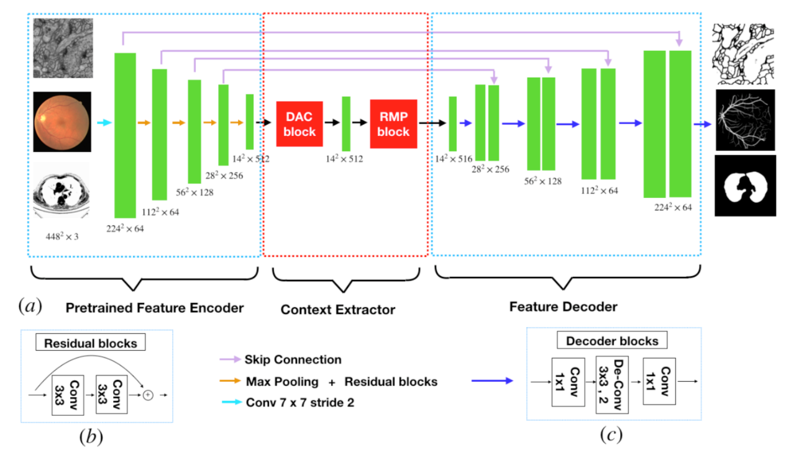

# Jun CHENG (程骏) 

## Institute for Infocomm Research, A\*STAR, Singapore
 

## Brief Bio:
Jun Cheng received the B. E. degree in electronic engineering and information science from the University of Science and Technology of China, and the Ph. D. degree from Nanyang Technological University, Singapore. 

He is now a senior research scientist in the Institute for Infocomm Research, working on AI for medical imaging, robotics and automation. He has authored/co-authored many publications at prestigious journals/conferences, such as TMI, TIP, TBME, IOVS, JAMIA, MICCAI, CVPR and invented more than 10 patents. He has received the IES Prestigious Engineering Achievement Award 2013. He serves as reviewers for many journal/conferences and area chairs for MICCAI. He is currently associate editor for IEEE Transaction on Medical Imaging. 

## Research Interest: 
* Computer Vision
* Medical Image Computing
* Robotics
* Machine Learning

 
## Positions:
* [Chinese CSC Scholarships](http://www.csc.edu.cn/chuguo): We are looking for exchange PhD students from China.
* [A\*STAR SINGA Scholarship](https://www.a-star.edu.sg/Scholarships/for-graduate-studies/singapore-international-graduate-award-singa): We are looking for PhD candiates. SINGA is a collaboration between A\*STAR and univerisities in Singapore to train students toward PhD. 
* [ARAP](https://www.a-star.edu.sg/Scholarships/for-graduate-studies/a-star-research-attachment-programme): We are looking for visiting students.
## Academic Services 
* ***Associate Editor***:
    -  **IEEE Transactions on Medical Imaging** 2015-present
    -  **IEEE Transactions on Image Processing** 2022-present
* ***Guest Editor***:
    -  **IEEE Journal on Biomedical and Health Informatics** Special Issue on Ophthalmic Image Analysis and Informatics, 2019
* ***Area Chair & Senior PC***:
    -  **MICCAI 2017**
    -  **MICCAI 2019**
    -  **MICCAI 2022**
    -  **AAAI 2022**
    -  **ICLR 2023**
* ***Chair***:
    -  **MICCAI workshop 2022**

## Professional Membership 
* Senior Member, Institute of Electrical and Electronics Engineers (IEEE)

## Research Grants:
*  Weakly Supervised Learning by Joint Convolutional and Graph Networks for Non-linear Medical Image Registration, A*STAR AI3 HTPO Seed Fund, 2022-2023.
*  Spatial Transcriptomics in Conjuction with Graph Neural Networks for Cell-Cell Interaction,A*STAR AI3 HTPO Seed Fund, 2022-2024.

## Highlighted Outcome:

* "MOS：A Low Latency and Lightweight Framework for Face Detection, Landmark Localization, and Head Pose Estimation"， 
Yepeng Liu, Zaiwang Gu, Shenghua Gao, Dong Wang, Yusheng Zeng, **Jun Cheng**\*, BMVC, 2021.
[\[Code\]](https://github.com/lyp-deeplearning/MOS-Multi-Task-Face-Detect)  

* "Noise Adaptation Generative Adversarial Network for Medical Image Analysis",
Tianyang Zhang, **Jun Cheng**\*, et al.,
IEEE Transactions on Medical Imaging (**TMI**), vol. 39, no. 4, pp. 1149-1159, 2020.
[\[Code\]](https://github.com/NeilZhang-IMED/NAGAN)    

* "CE-Net: Context Encoder Network for Medical Image Segmentation", 
Zaiwang Gu, **Jun Cheng**\*, et al., 
IEEE Transactions on Medical Imaging (**TMI**),  vol. 38, no. 10, pp. 2281-2292, 2019. [\[PDF\]](https://arxiv.org/abs/1903.02740) [\[Code\]](https://github.com/samjcheng/CE-Net)   *ESI highly cited! MICS 2019 Best poster!*    *The 50 most frequently accessed documents for TMI！*   *Top-20 Most Cited Paper within 5 Years in IEEE TMI 2022*

## Keynote Speech & Invited Talks:

* Glaucoma Screening from Fundus Images And Its Challenges, at BOOM workshop in conjuction with IJCAI 2019.
* Structure-preserving guided retinal image filtering and its application for optic disc analysis, MICS 2019.

## News:  
* 2022-08: Be invited to serve as Area Chair for ICLR 2023
* 2022-07: Be invited to serve as Associate Editor for IEEE TIP.
* 2022-01: Serve as an Area Chair for MICCAI 2022.
* 2021-10: MICCAI 2022 workshop call for proposal: https://conferences.miccai.org/2022/en/CALL-FOR-WORKSHOPS.html
* 2021-10: One paper "MOS: A Low Latency and Lightweight Framework for Face Detection, Landmark Localization, and Head Pose Estimation" has been accepted by BMVC.
* 2021-09: One paper "Proxy-bridged Image Reconstruction Network for Anomly Detection in Medical Images" has been accepted by IEEE Transactions on Medical Imaging.
* 2021-07: One paper "Structure and Illumination Constrained GAN for Medical Image Enhancement" has been accepted by IEEE Transactions on Medical Imaging.
* 2021-07: One paper "Memorizing Structure-Texture Correspondence for Image Anomaly Detection" has been accepted by IEEE Transactions on Neural Networks and Learning Systems. 
## Awards:
* IEEE TMI Distinguished Reviewer, 2021.
* IES Prestigious Engineering Achievement Award, 2013.

## Selected Publications:  
* Shuping Hu, Kan Wang, **Jun Cheng**, Huan Tan, and Jianxin Pang, Triplet Ratio Loss for Robust Person Re-identification, PRCV 2022.
* Kang Zhou, Jing Li, Yuting Xiao, Jianlong Yang, **Jun Cheng**, Wen Liu, Weixin Luo, Jiang Liu, Shenghua Gao, Memorizing Structure-Texture Correspondence for Image Anomaly Detection, IEEE Transactions on Neural Networks and Learning Systems (**TNNLS**), vol. 33, no. 6, pp. 2335-2349, 2022.
* Kang Zhou, Jing Li, Weixin Luo, Zhengxin Li, Jianlong Yang, Huazhu Fu, **Jun Cheng**, Jiang Liu, Shenghua Gao, Proxy-bridged Image Reconstruction Network for Anomaly Detection in Medical Images, IEEE Transactions on Medical Imaging (**TMI**), vol. 41, no. 3, pp. 582-594, March 2022.
* Yepeng Liu, Zaiwang Gu, Shenghua Gao, Dong Wang, Yusheng Zeng, **Jun Cheng**, MOS: A Low Latency and Lightweight Framework for Face Detection, Landmark Localization, and Head Pose Estimation, BMVC, 2021.
* Yuhui Ma, Jiang Liu, Yonghuai Liu, Huazhu Fu, Yan Hu, **Jun Cheng**, Hong Qi, Yufei Wu, Jiong Zhang, Yitian Zhao, Structure and Illumination Constrained GAN for Medical Image Enhancement, IEEE Transactions on Medical Imaging (**TMI**) 2021.
* Pengqian Li, Xiaofen Xing, Xiangmin Xu, Bolun Cai, **Jun Cheng**, Attention Concentrated Network for Saliency Prediction, Neurocomputing,  vol. 429,  pp. 199-214, 2021.
* Ae Ra Kee, Vivien Cherng Hui Yip, Elton Lik Tong Tay, Ching Wei Lim, **Jun Cheng**, Hwei Yee Teo, Chun Hau Chua, Leonard Wei Leon Yip, Comparison of two different optical coherence tomography angiography devices in detecting healthy versus glaucomatous eyes – An observational cross-sectional study, BMC Ophthalmology, 2020.
* Lei Mou, Yitian Zhao, Huazhu Fu, Yonghuai Liu, Jun Cheng, Yalin Zheng, Pan Su, Jianlong Yang, Li Chen, Alejandro Frangi, Masahiro Akiba, Jiang Liu, CS2-Net:Deep Learning Segmentation of Curvilinear Structures in Medical Imaging, Medical Image Analysis (**MIA**), 2020.
* Kang Zhou, Yuting Xiao, Jianlong Yang, **Jun Cheng**, Wen Liu, Weixin Luo, Zaiwang Gu, Jiang Liu, Shenghua Gao, Encoding Structure-Texture Relation with P-Net for Anomaly Detection in Retinal Images, European Conference on Computer Vision (**ECCV**), 2020.
* Yuhui Ma, Yonghuai Liu, **Jun Cheng**, Yalin Zheng, Morteza Ghahremani, Honghan Chen, Jiang Liu, Yitian Zhao, Cycle Structure and Illumination Constrained GAN for Medical Image Enhancement, Medical Image Computing and Computer Assisted Interventions (**MICCAI**), 2020
* Lei Mou, Li Chen,  **Jun Cheng**\*, Zaiwang Gu, Yitian Zhao and Jiang Liu, Dense Dilated Network with Probability Regularized Walk for Vessel Detection, IEEE Trans. On Medical Imaging (**TMI**), vol. 39, no. 5, pp. 1392-1403, 2020
* Tianyang Zhang, **Jun Cheng**\*, Huazhu Fu, Zaiwang Gu, Yuting Xiao, Kang Zhou, Shenghua Gao, Rui Zheng, Jiang Liu, Noise Adaptation Generative Adversarial Network for Medical Image Analysis, IEEE Trans. On Medical Imaging (**TMI**), vol. 39, no. 4, pp. 1149-1159, 2020. [\[Code\]](https://github.com/NeilZhang-IMED/NAGAN)    
* Yuming Jiang, Lixin Duan, **Jun Cheng**\*, Zaiwang Gu, Hu Xia, Huazhu Fu, Changsheng Li, Jiang Liu, JointRCNN: A Region-based Convolutional Neural Network for Optic Disc and Cup Segmentation, IEEE Trans. On Biomedical Engineering (**TBME**), vol. 67, no. 2, pp. 335-343, 2020.  
* Jianlong Yang*, Yan Hu, Liyang Fang, Jun Cheng, Jiang Liu, Universal digital filtering for denoising volumetric retinal OCT and OCT angiography in 3D shearlet domain,  Optics Letters (**OL**) 45(3), 694-697, 2020.
* Ting Zhou, Jianlong Yang, Kang Zhou, Liyang Fang, Yan Hu, Jun Cheng, Yitian Zhao, Xiangping Chen, Shenghua Gao, and Jiang Liu, Digital resolution enhancement in low transverse sampling optical coherence tomography angiography using deep learning, OSA Continuum,  Vol. 3, Issue 6, pp. 1664-1678, 2020.
* Kang Zhou, Shenghua Gao, **Jun Cheng**, Zaiwang Gu, Huazhu Fu, Zhi Tu, Jianlong Yang, Yitian Zhao, Jiang Liu, Sparse-GAN: Sparsity-constrained Generative Adversarial Network for Anomaly Detection in Retinal OCT Image, International Symposium on Biomedical Imaging  (**ISBI**), 2020.
* Yan Hu, Jianlong Yang, **Jun Cheng**, Jiang Liu, Noise Redistribution and 3D Shearlet Filtering for Speckle Reduction in Optical Coherence Tomography, International Symposium on Biomedical Imaging  (**ISBI**), 2020.
* Zhi Tu, Shenghua Gao, Kang Zhou, Xianing Chen, Huazhu Fu, Zaiwang Gu, **Jun Cheng**, Zehao Yu, Jiang Liu, SUNet: A Lesion Regularized Model for Simultaneous Diabetic Retinopathy and Diabetic Macular Edema Grading, International Symposium on Biomedical Imaging  (**ISBI**), 2020.
* Yuting Xiao, Shenghua Gao, Zhenjie Chai, Kang Zhou, Tianyang Zhang, Yitian Zhao, **Jun Cheng**, Jiang Liu, Open-Set Oct Image Recognition with Synthetic Learning, International Symposium on Biomedical Imaging (**ISBI**), 2020.
* Qifeng Yan, Mengdi Xu,Damon Wing Kee Wong, Akira Taruya, Atsushi Tanaka, Jiang Liu, Philip Wong, **Jun Cheng***, Automatic Fibroatheroma Identification in Intravascular Optical Coherence Tomography Volumes, Journal of Ambient Intelligence and Humanized Computing, 2019.
* Zaiwang Gu, **Jun Cheng**\*, Kang Zhou, Huaying Hao, Yitian Zhao, Tianyang Zhang, Shenghua Gao, Jiang Liu, CE-Net: Context Encoder Network for 2D Medical Image Segmentation,
IEEE Trans. On Medical Imaging (**TMI**), vol. 38, no. 10, pp. 2281-2292, 2019. [\[PDF\]](https://arxiv.org/abs/1903.02740) [\[Code\]](https://github.com/samjcheng/CE-Net)    *ESI highly cited! MICS 2019 Best poster!*    *The 50 most frequently accessed documents for TMI！*   *Top-20 Most Cited Paper within 5 Years in IEEE TMI 2022*
*  V. C. H. Yip, H. T. Wong, V. K. Y. Yong, B. A. Lim, O. K. Heel, **Jun Cheng**, H. Fu, C. W. Lim, E. L. T. Tay, R. GLoo-Valdez, H. Y. Teo, A. P. H. Lim, L. W. L. Yip,   Optical coherence tomography angiography of optic disc and macular vessel density in glaucoma and healthy eyes, Journal of Glaucoma (**JOG**), Jan;28(1):80-87, 2019.
* Jimmy Addison Lee, Peng Liu, **Jun Cheng**\* and Huazhu Fu,  A Deep Step Pattern Representation for Multimodal Retinal Image Registration,  
in IEEE International Conference in Computer Vision (**ICCV**), 2019. [\[PDF\]](https://openaccess.thecvf.com/content_ICCV_2019/papers/Lee_A_Deep_Step_Pattern_Representation_for_Multimodal_Retinal_Image_Registration_ICCV_2019_paper.pdf)
* Jianyang Xie, Yitian Zhao, Yonghuai Liu, Pan Su, Yalin Zheng, Yifan Zhao, **Jun Cheng**, Jiang Liu,   
Topology Reconstruction of Tree-like Structure in Images via Structural Similarity Measure and Dominant Set Clustering, in IEEE International Conference in Computer vision and Pattern Recognition (**CVPR**), Long Beach, USA, June, 2019. 
* Hengrong Lan, Kang Zhou, Changchun Yang, **Jun Cheng**, Jiang Liu, Shenghua Gao, Fei Gao, Ki-GAN: Knowledge Infusion Generative Adversarial Network for Photoacoustic Image Reconstruction in vivo, in International Conference on Medical Image Computing and Computer Assisted Intervention (**MICCAI**), 2019.
* Lei Mou, Yitian Zhao, Li Chen, **Jun Cheng**, Zaiwang Gu, Huaying Hao, Hong Qi,  Yalin Zheng, Alex Frangi, Jiang Liu, CS-Net: Channel and Spatial Attention Network for Curvilinear Structure Segmentation, in International Conference on Medical Image Computing and Computer Assisted Intervention (**MICCAI**), 2019.
* Tianyang Zhang, Huazhu Fu, Yitian Zhao, **Jun Cheng**, Mengjie Guo, Zaiwang Gu, Bing Yang, Yuting Xiao, Shenghua Gao, Jiang Liu,  SkrGAN: Sketching-rendering Unconditional Generative Adversarial Networks for Medical Image Synthesis, in International Conference on Medical Image Computing and Computer Assisted Intervention (**MICCAI**), 2019.
* **Jun Cheng**\*, Sparse Range-constrained Learning and Its Application for Medical Image Grading, IEEE Transactions on Medical Imaging (**TMI**), vol. 37, no. 12, pp. 2729-2738, 2018. 
* **Jun Cheng**\*, Zhengguo Li, Zaiwang Gu, Huazhu Fu, Damon Wing Kee Wong, Jiang Liu, Structure-preserving Guided Retinal Image Filtering and Its Application for Optic Disc Analysis, IEEE Transactions on Medical Imaging (**TMI**), vol. 37, no. 11, pp. 2536-2546, 2018.  [\[PDF\]](https://arxiv.org/abs/1805.06625) [\[Code\]](https://github.com/samjcheng/structure-preserving-guided-retinal-image-filtering)   
* Huazhu Fu, **Jun Cheng**\*, Yanwu Xu\*,  Changqing Zhang, Damon Wing Kee Wong, Jiang Liu, Xiaochun Cao, Disc-aware Ensemble Network for Glaucoma Screening from Fundus Image,  
IEEE Transactions on Medical Imaging (**TMI**), vol. 37, no. 11, pp. 2493-2501, 2018.  [\[PDF\]](https://arxiv.org/abs/1805.07549) [\[Code\]](https://github.com/HzFu/DENet_GlaucomaScreen)   
* Huazhu Fu, **Jun Cheng**, Yanwu Xu, Damon Wing Kee Wong, Jiang Liu, Xiaochun Cao, Joint Optic Disc and Cup Segmentation Based on Multi-label Deep Network and Polar Transformation, IEEE Transactions on Medical Imaging (**TMI**), vol. 37, no 7, pp. 1597-1605, 2018. [\[PDF\]](https://arxiv.org/abs/1801.00926) [\[Code\]](https://github.com/HzFu/MNet_DeepCDR)    *ESI highly cited!*   *Top-20 Most Cited Paper within 5 Years in IEEE TMI 2022*
***"ESI Highly Cited)”***
* Ruchir Srivastava, Ai Ping Yow, **Jun Cheng**, Damon Wing Kee Wong,  Hong Liang Tey, 3D graph-based skin layer segmentation in optical coherence tomography images for roughness estimation", Biomedical Optics Express (**BOE**), vol. 9, no. 8, pp. 3590-3606, 2018.
* Annan Li, Zhiheng Niu, **Jun Cheng**, Fengshou Yin, Damon Wing Kee Wong, Shuicheng Yan, Jiang Liu, Learning Supervised Descent Directions for Optic Disc Segmentation,Neurocomputing, vol. 275, pp. 350-357 2018.
* Ching Wei Lim, **Jun Cheng**, Elton Lik Tong Tay, Hwei Yee Teo, Elizabeth Poh Ying Wong, Vernon Khet Yau Yong, Boon Ang Lim, Owen Kim Hee, Hon Tym Wong,	Leonard Wei Leon Yip, 
Optical coherence tomography of the macula and optic nerve head: microvascular density and test-retest repeatability in normal subjects, BMC ophthalmology (**BMC**), 2018.
* Yitian Zhao, Jianyang Xie, Yalin Zheng, Yonghuai Liu, Pan Su, Yifan Zhao, **Jun Cheng**, Jiang Liu, Retinal Artery and Vein Classification via Dominant Sets Clustering-based Vascular Topology Estimation, in International Conference on Medical Image Computing and Computer Assisted Intervention (**MICCAI**), pp. 56-64, Granada, Spain, September, 2018.
* **Jun Cheng**\*, Zhuo Zhang, Dacheng Tao, Damong Wing Kee Wong, Jiang Liu, Mani Baskaran, Tin Aung, Tien Yin Wong,  Similarity regularized Sparse Group Lasso for Cup to Disc Ratio Computation**,  Biomedical Optics Express (**BOE**), vol. 8, issue  8, pp. 3763-3777, 2017.
* **Jun Cheng**\*, Dacheng Tao, Damon Wing Kee Wong, Jiang Liu,  Quadratic divergence regularized SVM for Optic Disc Segmentation, Biomedical Optics Express (**BOE**), vol.8, issue 5, pp. 2687-2696, 2017.
* **Jun Cheng**\*, Dacheng Tao, Ying Quan, Damon Wing Kee Wong,   Gemmy Chui Ming Cheung, Masahiro Akiba, Jiang Liu,  Speckle Reduction in 3D Optical Coherence Tomography of Retina  by A-Scan Reconstruction, IEEE Trans on Medical Imaging (**TMI**), vol. 35, no. 10, pp. 2270-2279, 2016. 
*  **Jun Cheng**\*, Fengshou Yin, Damon Wing Kee Wong, Dacheng Tao and Jiang Liu,  Sparse Dissimilarity-Constrained Coding For Glaucoma Screening, IEEE Trans. on Biomedical Engineering (**TBME**), vol. 62, Issue 5, pp. 1395-1403, 2015.
* M. Baskaran, **Jun Cheng**, S. A. Perera, T. A. Tun, J. Liu and T. Aung,  Automated Analysis of Angle Closure From Anterior Chamber Angle Images,  Investigative Ophthalmology & Visual Science (**IOVS**), 55(11):7669-7673, 2014. 
* **Jun Cheng***,  J. Liu, Y. Xu, F. Yin, D. W. K. Wong, N. M. Tan, D. Tao, C. Y. Cheng, T. Aung and T. Y. Wong,  Superpixel Classification based Optic Disc and Optic Cup Segmentation for Glaucoma Screening**, IEEE Trans. on Med. Imaging (**TMI**), vol. 32, no. 6, pp. 1019-1032, 2013.  (Selected for highlighting by A\*STAR Research)
* J. Liu, Z. Zhang, D. W. K. Wong, Y. Xu, F. Yin, **Jun Cheng**, N. M. Tan , C. K. Kwoh, D. Xu, Y. C. Tham, T. Aung and T. Y. Wong, Automatic Glaucoma Diagnosis through Medical Imaging Informatics, Journal of the American Medical Informatics Association (**JAMIA**), 20(6):1021-7, 2013.
*  **Jun Cheng**\*, Dacheng Tao, Jiang Liu, Damon Wing Kee Wong, Ngan Meng Tan, Tien Yin Wong and Seang Mei Saw, Peripapillary Atrophy Detection  by Sparse Biologically Inspired Feature Manifold, IEEE Trans. on Med. Imaging (**TMI**), vol. 31, no. 12, pp. 2355-2365, 2012. (IF2012: 4.027) 
*  M. H. Wong, A. Chew, H. M. Htoon, B. H. Lee, **Jun Cheng**, J. Liu, D. T. Tan and J. S. Mehta, Reproducibility of Corneal Graft Thickness measurements with COLGATE in patients who have undergone DSAEK (Descemet Stripping Automated Endothelial Keratoplasty, BMC Med Imaging (**BMC**),12(1):25, 2012. 
*  **Jun Cheng*** and A. C. Kot,  Steganalysis of halftone images using inverse halftoning, Signal Processing , vol. 89, Issue 6, pp. 1000-1010, June 2009. 
* **Jun Cheng**\* and A. C. Kot, Objective distortion measure for binary text image based on edge line segment similarity,  EEE Trans. On Image Processing (**TIP**),  vol. 16, pp. 1691-1695, June 2007.
* Ee Ping Ong, Jimmy Addison Lee, **Jun Cheng**, Guozhen Xu, Beng Hai Lee, Augustinus Laude, Stephen Teoh, Tock Han Lim, Damon W. K. Wong, Jiang Liu, A robust outlier’s elimination approach for multimodal retinal image registration, in International Conference on Medical Image Computing and Computer Assisted Intervention (**MICCAI**), Part II, LNCS 9350, pp. 329–337, 2015.
* Jimmy Addison Lee, **Jun Cheng**, Guozhen Xu, Ee Ping Ong, Beng Hai Lee, Damon Wing Kee Wong, Jiang Liu,  Registration of color and OCT fundus image using low-dimensional step pattern analysis,  in International Conference on Medical Image Computing and Computer Assisted Intervention (**MICCAI**), Part II, LNCS 9350, pp. 214-221, 2015.  
* Jimmy Addison Lee, **Jun Cheng**, Beng Hai Lee, Ee Ping Ong, Guozhen Xu, Damon Wing Kee Wong, Jiang Liu, Augustinus Laude, Tock Han Lim,  A Low-dimensional Step Pattern Analysis Algorithm with Application to Multimodal Retinal Image Registration, in Computer Vision and Pattern Recognition (**CVPR**), pp.1046-1053, 2015.  
* **Jun Cheng**\*, Lixin Duan, Damon Wing King Wong, Dacheng Tao, Masaharo Akiba, Jiang Liu, Speckle Reduction in Optical Coherence Tomography by Image Registration and Matri Completion, in International Conference on Medical Image Computing and Computer Assisted Intervention (**MICCAI**), Part I, LNCS 8673, pp. 162-169, 2014.  
* **Jun Cheng**\*, Jiang Liu, Dacheng Tao, Fengshou Yin, Damon Wing Kee Wong, Tien Yin Wong, Superpixel Classification based Optic Cup Segmentation, in International Conference on Medical Image Computing and Computer Assisted Intervention (**MICCAI**), Part III, LNCS 8151, pp. 421–428, 2013.   
* **Jun Cheng**\*, Dacheng Tao, Jiang Liu, Damon Wing Kee Wong, Beng Hai Lee, Mani Baskaran, Tien Yin Wong and Tin Aung, Focal Biologically Inspired Feature for Glaucoma Type Classification, Int. Conf. on Medical Image Computing and Computer Assisted Intervention (**MICCAI**), Part III, LNCS 6893, pp. 91-98. Springer, Heidelberg, 2011. 

### Book Chapter: 
* **Techniques and Applications in Skin OCT Analysis**,  
A. P. Yow, R. Srivastava, **Jun Cheng**, A. Li, J. Liu, L. Schmetterer, H. L. Tey, D. W. K. Wong,   
Deep Learning in Medical Image Analysis Challenges and Applications, Editors: Lee, Gobert, Fujita, Hiroshi (Eds.), Springer, 2020.  
* **Automatic segmentation of retinal images for glaucoma screening**,   
**Jun Cheng**, F. Yin, D. W. K. Wong, J. Liu,    
Frontiers of Medical Imaging, C. H. Chen (eds.), World Scientific, 2014
* **Glaucoma Detection Based on Deep Learning Network in Fundus Image**,  
Huazhu Fu, **Jun Cheng**, Yanwu Xu, Jiang Liu,  
Deep Learning and Convolutional Neural Networks for Medical Imaging and Clinical Informatics, Springer, 2019
* **Structure-preserving Guided Retinal Image Filtering for Optic Disc Analysis**   
**Jun Cheng**, Z. Li, H. Fu, Z. Gu, D. W. K. Wong and J. Liu,
Computational Retinal Image Analysis, E. Trucco (eds.), Elsevier, 2019.
